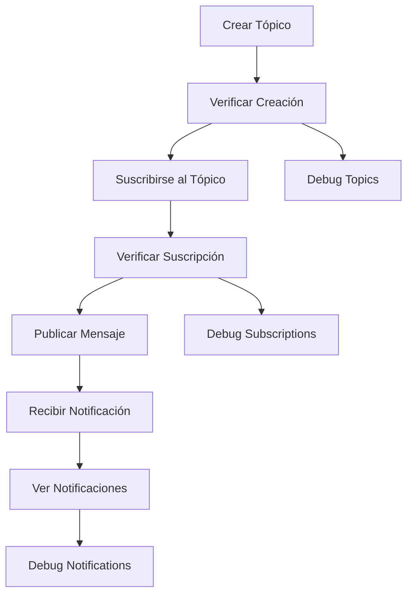

# CRUD_SNS_NodeJS_AWS
Modelo CRUD para la comunicación entre lambdas a través de amazon simple notification service (SNS) implementado con Systems Manager Parameter Store, Api-Gateway, Amazon SNS, Serverless-Framework, Lambda, NodeJs, aws sdk-v3, entre otros.

* [Playlist proyecto](https://www.youtube.com/watch?v=sGK_4FQBdP8&list=PLCl11UFjHurCkJNddrHBJ_TUfMlrHuWyb)


<br>

## Índice 📜

<details>
 <summary> Ver </summary>
 
 <br>
 
### Sección 1) Descripción, Tecnologías y Referencias

 - [1.0) Descripción del Proyecto.](#10-descripción-)
 - [1.1) Ejecución del Proyecto.](#11-ejecución-del-proyecto-)
 - [1.2) Configurar el proyecto serverless desde cero](#12-configurar-el-proyecto-serverless-desde-cero-)
 - [1.3) Tecnologías.](#13-tecnologías-)

### Sección 2) Endpoints y Ejemplos 
 
 - [2.0) EndPoints y recursos.](#20-endpoints-y-recursos-)
 - [2.1) Ejemplos](#21-ejemplos-)
 - [2.2) Nuevas Funcionalidades](#22-nuevas-funcionalidades-)

### Sección 3) Prueba de funcionalidad y Referencias
 
 - [3.0) Prueba de funcionalidad.](#30-prueba-de-funcionalidad-)
 - [3.1) Referencias.](#31-referencias-)

<br>

</details>


<br>

## Sección 1) Descripción, Tecnologías y Dependencias 


### 1.0) Descripción [🔝](#índice-) 

<details>
  <summary>Ver</summary>
 
 <br>

### 1.0.0) Descripción General

Este proyecto implementa un sistema CRUD completo para Amazon Simple Notification Service (SNS) utilizando Node.js y el Serverless Framework. El sistema permite la gestión completa de tópicos SNS, incluyendo su creación, listado, publicación de mensajes y gestión de suscripciones.

Características principales:
- Implementación de arquitectura serverless utilizando AWS Lambda
- Integración con Amazon SNS para mensajería pub/sub
- API RESTful protegida con API Key
- Gestión de configuración mediante SSM Parameter Store
- Soporte para desarrollo local con serverless-offline
- Manejo de eventos SNS y HTTP
- Implementación de patrones de diseño para mensajería asíncrona

### 🆕 Nuevas Características Implementadas:
- **Sistema de Webhooks**: Endpoints para recibir notificaciones SNS en modo offline
- **Persistencia de Datos**: Almacenamiento en archivos JSON para tópicos, suscripciones y notificaciones
- **Endpoints de Debug**: Herramientas para troubleshooting y monitoreo del estado del sistema
- **Validaciones Mejoradas**: Verificación de existencia de tópicos y validación de parámetros
- **Simulación Realista**: Comportamiento más cercano al SNS real con persistencia entre reinicios
- **Manejo de Errores Mejorado**: Mensajes más descriptivos y listado de recursos disponibles

<br>

<br>

### 1.0.1) Descripción Arquitectura y Funcionamiento

#### Arquitectura del Sistema

El sistema está compuesto por los siguientes componentes principales:

1. **API Gateway**
   - Punto de entrada para todas las peticiones HTTP
   - Implementa autenticación mediante API Key
   - Enruta las peticiones a las funciones Lambda correspondientes

2. **Funciones Lambda**
   - **Gestión de Tópicos**
     - `createManualTopic`: Crea nuevos tópicos SNS
     - `listTopics`: Lista todos los tópicos disponibles
   - **Publicación**
     - `publishTopic`: Publica mensajes en tópicos específicos
   - **Suscripciones**
     - `subscribeTopic`: Gestiona suscripciones a tópicos
     - `listSubscriptionTopic`: Lista suscripciones por tópico

3. **Amazon SNS**
   - Servicio de mensajería pub/sub
   - Gestiona tópicos y suscripciones
   - Distribuye mensajes a los suscriptores

4. **SSM Parameter Store**
   - Almacena configuración sensible
   - Gestiona variables de entorno
   - Configuración de endpoints y credenciales

<br>

<br>

#### Flujo de Datos e Implementación


#### Pasos del Flujo
1. **Crear Tópico** → Obtener TopicArn
2. **Listar Tópicos** → Verificar creación
3. **Suscribirse** → Obtener SubscriptionArn
4. **Publicar Mensaje** → Enviar mensaje al tópico
5. **Listar Suscripciones** → Verificar suscripciones

1. **Creación de Tópicos**
   ```
   Cliente -> API Gateway -> Lambda -> SNS -> Tópico Creado
   ```

2. **Publicación de Mensajes**
   ```
   Cliente -> API Gateway -> Lambda -> SNS -> Suscriptores
   ```

3. **Suscripción a Tópicos**
   ```
   Cliente -> API Gateway -> Lambda -> SNS -> Confirmación
   ```

#### Configuración Local

El proyecto incluye configuración para desarrollo local:
- Serverless Offline para simular AWS Lambda
- SNS Offline para simular Amazon SNS
- SSM Offline para simular Parameter Store
- Puertos configurables para cada servicio

#### Seguridad

- Autenticación mediante API Key
- Variables de entorno gestionadas por SSM
- Credenciales AWS configuradas de forma segura
- Endpoints protegidos en API Gateway

#### Desarrollo y Despliegue

- Framework: Serverless v3
- Runtime: Node.js 18.x
- Región: us-east-1
- Memoria Lambda: 512MB
- Timeout: 10 segundos

<br>

</details>


### 1.1) Ejecución del Proyecto [🔝](#índice-)

<details>
  <summary>Ver</summary>

* Creamos un entorno de trabajo a través de algún ide, podemos o no crear una carpeta raíz para el proyecto, nos posicionamos sobre la misma
```git
cd 'projectRootName'
```
* Una vez creado un entorno de trabajo a través de algún ide, clonamos el proyecto
```git
git clone https://github.com/andresWeitzel/SNS_NodeJS_AWS
```
* Nos posicionamos sobre el proyecto
```git
cd 'projectName'
```
* Instalamos la versión LTS de [Nodejs(v18)](https://nodejs.org/en/download)
* Instalamos el Serverless Framework globalmente si aún no lo hemos hecho. Recomiendo la version tres ya que es gratuita y no nos pide credenciales. Se puede usar la última version (cuatro) sin problemas, aunque es de pago.
```git
npm install -g serverless@3
```
* Verificamos la versión de Serverless instalada
```git
sls -v
```
* Instalamos todos los paquetes necesarios
```git
npm i
```
* Las variables ssm utilizadas en el proyecto se mantienen para simplificar el proceso de configuración del mismo. Es recomendado agregar el archivo correspondiente (serverless_ssm.yml) al .gitignore.
* El siguiente script configurado en el package.json del proyecto es el encargado de
   * Levantar serverless-offline (serverless-offline)
 ```git
  "scripts": {
    "serverless-offline": "sls offline start",
    "start": "npm run serverless-offline"
  },
```
* Ejecutamos la app desde terminal.
```git
npm start
```
* Si se presenta algún mensaje indicando qué el puerto 4567 ya está en uso, podemos terminar todos los procesos dependientes y volver a ejecutar la app
```git
npx kill-port 4567
npm start
```
 
 
<br>

</details>

### 1.2) Configurar el proyecto serverless desde cero [🔝](#índice-)

<details>
  <summary>Ver</summary>
 
 <br>
 
* Creamos un entorno de trabajo a través de algún ide, podemos o no crear una carpeta raíz para el proyecto, nos posicionamos sobre la misma
```git
cd 'projectRootName'
```
* Una vez creado un entorno de trabajo a través de algún ide, clonamos el proyecto
```git
git clone https://github.com/andresWeitzel/SNS_NodeJS_AWS
```
* Nos posicionamos sobre el proyecto
```git
cd 'projectName'
```
* Instalamos la última versión LTS de [Nodejs(v18)](https://nodejs.org/en/download)
* Instalamos Serverless Framework de forma global si es que aún no lo hemos realizado
```git
npm install -g serverless
```
* Verificamos la versión de Serverless instalada
```git
sls -v
```
* Inicializamos un template de serverles
```git
serverless create --template aws-nodejs
```
* Inicializamos un proyecto npm
```git
npm init -y
```
* Instalamos serverless offline
```git
npm i serverless-offline --save-dev
```
* Agregamos el plugin al .yml
```git
plugins:
  - serverless-offline
```
* Instalamos serverless ssm
```git
npm i serverless-offline-ssm --save-dev
```
* Agregamos el plugin al .yml
```git
plugins:
  - serverless-offline-ssm
  - serverless-offline
```
* Instalamos serverless sns
```git
npm i serverless-offline-sns --save-dev
```
* Agregamos el plugin al .yml
```git
plugins:
  - serverless-offline-sns
  - serverless-offline-ssm
  - serverless-offline
```
* Instalamos serverless, este deberá ser necesario para el uso de SNS
```git
npm i serverless --save-dev
```
* Instalamos el plugin para el uso de sns (aws-sdk-v3)
```git
npm i @aws-sdk/client-sns --save-dev
```
* Para la configuración de puertos, topics, etc, (de este plugin) dirigirse a la [página de serverless, sección plugins](https://www.serverless.com/plugins/serverless-offline-sns) y para los recursos SNS [página de serverless, sección eventos sns](https://www.serverless.com/framework/docs/providers/aws/events/sns/)
* Las variables ssm utilizadas en el proyecto se mantienen para simplificar el proceso de configuración del mismo. Es recomendado agregar el archivo correspondiente (serverless_ssm.yml) al .gitignore.
* Instalamos la dependencia para la ejecución de scripts en paralelo
``` git
npm i concurrently
``` 
* El siguiente script configurado en el package.json del proyecto es el encargado de
   * Levantar serverless-offline (serverless-offline)
 ```git
  "scripts": {
    "serverless-offline": "sls offline start",
    "start": "npm run serverless-offline"
  },
```
* Ejecutamos la app desde terminal.
```git
npm start
```
* Si se presenta algún mensaje indicando qué el puerto 4567 ya está en uso, podemos terminar todos los procesos dependientes y volver a ejecutar la app
```git
npx kill-port 4567
npm start
```
* `Importante: ` Esta es una configuración inicial, se omiten pasos para simplificar la documentación. Para más información al respecto, dirigirse a la [página oficial de serverless, sección plugins](https://www.serverless.com/plugins)


</details>


### 1.3) Tecnologías [🔝](#índice-) 

<details>
  <summary>Ver</summary>
 
 <br>
 
### Tecnologías Implementadas

| **Tecnologías** | **Versión** | **Finalidad** |               
| ------------- | ------------- | ------------- |
| [SDK](https://www.serverless.com/framework/docs/guides/sdk/) | 4.3.2  | Inyección Automática de Módulos para Lambdas |
| [Serverless Framework Core v3](https://www.serverless.com//blog/serverless-framework-v3-is-live) | 3.23.0 | Core Servicios AWS |
| [Serverless Plugin](https://www.serverless.com/plugins/) | 6.2.2  | Librerías para la Definición Modular |
| [Systems Manager Parameter Store (SSM)](https://docs.aws.amazon.com/systems-manager/latest/userguide/systems-manager-parameter-store.html) | 3.0 | Manejo de Variables de Entorno |
| [Amazon Simple Queue Service (SQS)](https://docs.aws.amazon.com/AWSSimpleQueueService/latest/SQSDeveloperGuide/welcome.html) | 7.0 | Servicio de colas de mensajes distribuidos | 
| [Elastic MQ](https://github.com/softwaremill/elasticmq) | 1.3 | Interfaz compatible con SQS (msg memory) | 
| [Amazon Api Gateway](https://docs.aws.amazon.com/apigateway/latest/developerguide/welcome.html) | 2.0 | Gestor, Autenticación, Control y Procesamiento de la Api | 
| [NodeJS](https://nodejs.org/en/) | 14.18.1  | Librería JS |
| [VSC](https://code.visualstudio.com/docs) | 1.72.2  | IDE |
| [Postman](https://www.postman.com/downloads/) | 10.11  | Cliente Http |
| [CMD](https://learn.microsoft.com/en-us/windows-server/administration/windows-commands/cmd) | 10 | Símbolo del Sistema para linea de comandos | 
| [Git](https://git-scm.com/downloads) | 2.29.1  | Control de Versiones |


</br>


### Plugins Implementados.

| **Plugin** | **Descarga** |               
| -------------  | ------------- |
| serverless-offline |  https://www.serverless.com/plugins/serverless-offline |
| serverless-offline-ssm |  https://www.npmjs.com/package/serverless-offline-ssm |
| serverless-offline-sqs | https://www.npmjs.com/package/serverless-offline-sqs |


</br>

### Extensiones VSC Implementados.

| **Extensión** |              
| -------------  | 
| Prettier - Code formatter |
| YAML - Autoformatter .yml (alt+shift+f) |
| DotENV |

<br>

</details>


<br>


## Sección 2) Endpoints y Ejemplos. 


### 2.0) Endpoints y recursos [🔝](#índice-)

<details>
  <summary>Ver</summary>

<br>

### 2.0.0) Descripción de Endpoints

El proyecto implementa un CRUD completo para Amazon SNS con los siguientes endpoints:

| **Endpoint** | **Método** | **Descripción** | **Autenticación** |
|-------------|------------|----------------|------------------|
| `/create-manual-topic` | POST | Crea un nuevo tópico SNS | Requiere API Key |
| `/list-topics` | GET | Lista todos los tópicos SNS disponibles | Requiere API Key |
| `/publish-topic` | POST | Publica un mensaje en un tópico específico | Requiere API Key |
| `/subscribe-topic` | POST | Suscribe un endpoint a un tópico específico | Requiere API Key |
| `/list-subscription-topic` | GET | Lista todas las suscripciones de un tópico específico | Requiere API Key |
| `/webhook/{topicName}` | POST | Recibe notificaciones SNS (modo offline) | Público |
| `/list-notifications` | GET | Lista todas las notificaciones recibidas | Requiere API Key |
| `/debug-topics` | GET | Debug del estado de tópicos (modo offline) | Requiere API Key |
| `/debug-subscriptions` | GET | Debug del estado de suscripciones (modo offline) | Requiere API Key |

### 2.0.1) Nuevas Características Implementadas

#### 🆕 Sistema de Webhooks
- **Endpoint**: `POST /webhook/{topicName}`
- **Descripción**: Recibe notificaciones SNS en modo offline
- **Funcionalidad**: 
  - Guarda notificaciones en archivo JSON
  - Simula el comportamiento real de SNS
  - Permite testing completo del flujo de mensajes

#### 🆕 Sistema de Debug
- **Endpoints**: `/debug-topics`, `/debug-subscriptions`
- **Descripción**: Herramientas para troubleshooting en modo offline
- **Funcionalidad**:
  - Muestra estado actual de tópicos y suscripciones
  - Información detallada de archivos de persistencia
  - Útil para desarrollo y debugging

#### 🆕 Persistencia Mejorada
- **Almacenamiento**: Archivos JSON en `.serverless/`
- **Archivos**:
  - `offline-topics.json`: Tópicos creados
  - `offline-subscriptions.json`: Suscripciones activas
  - `offline-notifications.json`: Notificaciones recibidas
- **Ventajas**: 
  - Persistencia entre reinicios del servidor
  - Simulación más realista de SNS
  - Fácil debugging y testing

#### 🆕 Validaciones Mejoradas
- Verificación de existencia de tópicos antes de suscribirse
- Validación de parámetros de entrada
- Mensajes de error más descriptivos
- Lista de tópicos disponibles en errores

### 2.0.2) Detalles de Implementación

#### Flujo de Implementación Mejorado


#### Pasos del Flujo Actualizado
1. **Crear Tópico** → Persistir en archivo JSON
2. **Listar Tópicos** → Leer desde archivo JSON
3. **Suscribirse** → Validar tópico + guardar suscripción
4. **Publicar Mensaje** → Simular envío a suscriptores
5. **Recibir Notificación** → Webhook guarda en archivo
6. **Listar Notificaciones** → Leer desde archivo JSON

#### Create Manual Topic (Mejorado)
- **Endpoint**: POST `/create-manual-topic`
- **Descripción**: Crea un nuevo tópico SNS con persistencia
- **Handler**: `src/lambdas/topic/createManualTopic.handler`
- **Funcionalidad**:
  - Guarda tópico en archivo JSON
  - Valida nombre del tópico
  - Retorna ARN simulado

#### List Topics (Mejorado)
- **Endpoint**: GET `/list-topics`
- **Descripción**: Lista tópicos desde archivo JSON
- **Handler**: `src/lambdas/topic/listTopics.handler`
- **Funcionalidad**:
  - Lee desde archivo persistente
  - No incluye tópicos de ejemplo automáticamente
  - Muestra solo tópicos creados por el usuario

#### Publish Topic (Mejorado)
- **Endpoint**: POST `/publish-topic`
- **Descripción**: Publica mensaje con validación de tópico
- **Handler**: `src/lambdas/publish/publishTopic.handler`
- **Funcionalidad**:
  - Valida que el tópico existe
  - Simula envío a suscriptores
  - Retorna información de delivery

#### Subscribe Topic (Mejorado)
- **Endpoint**: POST `/subscribe-topic`
- **Descripción**: Suscribe con validación y webhook automático
- **Handler**: `src/lambdas/subscribe/subscribeTopic.handler`
- **Funcionalidad**:
  - Valida existencia del tópico
  - Usa webhook automático: `http://127.0.0.1:4000/dev/webhook/{topicName}`
  - Guarda suscripción en archivo JSON

#### List Subscription Topic (Mejorado)
- **Endpoint**: GET `/list-subscription-topic`
- **Descripción**: Lista suscripciones con filtrado por tópico
- **Handler**: `src/lambdas/subscribe/listSubscriptionTopic.handler`
- **Funcionalidad**:
  - Permite especificar tópico via query parameter
  - Lee desde archivo JSON
  - Agrupa suscripciones por tópico

#### Webhook Receiver (Nuevo)
- **Endpoint**: POST `/webhook/{topicName}`
- **Descripción**: Recibe notificaciones SNS
- **Handler**: `src/lambdas/webhook/webhookReceiver.handler`
- **Funcionalidad**:
  - Recibe notificaciones HTTP
  - Guarda en archivo JSON
  - Responde 200 OK para evitar reintentos

#### List Notifications (Nuevo)
- **Endpoint**: GET `/list-notifications`
- **Descripción**: Lista notificaciones recibidas
- **Handler**: `src/lambdas/webhook/listNotifications.handler`
- **Funcionalidad**:
  - Filtrado por tópico
  - Agrupación por tópico
  - Información detallada de cada notificación

#### Debug Endpoints (Nuevos)
- **Endpoints**: `/debug-topics`, `/debug-subscriptions`
- **Descripción**: Herramientas de debugging
- **Funcionalidad**:
  - Estado actual del sistema
  - Información de archivos
  - Solo disponible en modo offline

### 2.0.3) Configuración de Seguridad

Todos los endpoints están protegidos con API Key. La configuración se realiza a través de:
- API Gateway con clave API (`xApiKey`)
- Variables de entorno gestionadas por SSM Parameter Store

### 2.0.4) Recursos SNS

El proyecto incluye un tópico SNS de ejemplo configurado en los recursos:
```yaml
TopicExample:
  Type: AWS::SNS::Topic
  Properties:
    TopicName: TopicExample
```

</details>


### 2.1) Ejemplos [🔝](#índice-)

<details>
  <summary>Ver</summary>

<br>

### 2.1.0) Configuración del Entorno de Pruebas

1. **Variables de Entorno en Postman**
   | **Variable** | **Valor** | **Descripción** |
   |-------------|-----------|----------------|
   | `base_url` | `http://localhost:4000/dev` | URL base para las peticiones |
   | `x-api-key` | `f98d8cd98h73s204e3456998ecl9427j` | API Key para autenticación |

2. **Headers Necesarios**
   ```json
   {
     "x-api-key": "{{x-api-key}}",
     "Content-Type": "application/json"
   }
   ```

### 2.1.1) Ejemplos de Uso

#### 1. Crear un Tópico
- **Endpoint**: `POST {{base_url}}/create-manual-topic`
- **Body**:
  ```json
  {
    "name": "MiTópicoPrueba"
  }
  ```
- **Respuesta Esperada**:
  ```json
  {
    "statusCode": 200,
    "body": {
      "message": "Topic created successfully (Offline)",
      "topicArn": "arn:aws:sns:us-east-1:123456789012:MiTópicoPrueba",
      "topicName": "MiTópicoPrueba",
      "note": "Topic is now available in the list-topics endpoint"
    }
  }
  ```

#### 2. Listar Tópicos
- **Endpoint**: `GET {{base_url}}/list-topics`
- **Respuesta Esperada**:
  ```json
  {
    "statusCode": 200,
    "body": {
      "message": "Topics retrieved successfully (Offline)",
      "topics": [
        {
          "TopicArn": "arn:aws:sns:us-east-1:123456789012:MiTópicoPrueba",
          "TopicName": "MiTópicoPrueba"
        }
      ],
      "totalTopics": 1
    }
  }
  ```

#### 3. Suscribirse a un Tópico
- **Endpoint**: `POST {{base_url}}/subscribe-topic`
- **Body**:
  ```json
  {
    "topicName": "MiTópicoPrueba",
    "protocol": "http",
    "endpoint": "http://127.0.0.1:4000/dev/webhook/MiTópicoPrueba"
  }
  ```
- **Respuesta Esperada**:
  ```json
  {
    "statusCode": 200,
    "body": {
      "message": "Successfully subscribed to topic (Offline)",
      "subscriptionArn": "arn:aws:sns:us-east-1:123456789012:MiTópicoPrueba:1752674712193",
      "topicName": "MiTópicoPrueba",
      "topicArn": "arn:aws:sns:us-east-1:123456789012:MiTópicoPrueba",
      "protocol": "http",
      "endpoint": "http://127.0.0.1:4000/dev/webhook/MiTópicoPrueba"
    }
  }
  ```

#### 4. Publicar Mensaje
- **Endpoint**: `POST {{base_url}}/publish-topic`
- **Body**:
  ```json
  {
    "topicName": "MiTópicoPrueba",
    "message": "Este es un mensaje de prueba",
    "subject": "Asunto de Prueba"
  }
  ```
- **Respuesta Esperada**:
  ```json
  {
    "statusCode": 200,
    "body": {
      "message": "Message published successfully (Offline)",
      "messageId": "msg_1752674712193_abc123def",
      "topicName": "MiTópicoPrueba",
      "topicArn": "arn:aws:sns:us-east-1:123456789012:MiTópicoPrueba",
      "deliveredToSubscriptions": 1,
      "note": "Notifications were simulated. Check webhook endpoint for actual delivery."
    }
  }
  ```

#### 5. Listar Suscripciones
- **Endpoint**: `GET {{base_url}}/list-subscription-topic?topicName=MiTópicoPrueba`
- **Respuesta Esperada**:
  ```json
  {
    "statusCode": 200,
    "body": {
      "message": "Subscriptions retrieved successfully (Offline)",
      "topicName": "MiTópicoPrueba",
      "topicArn": "arn:aws:sns:us-east-1:123456789012:MiTópicoPrueba",
      "subscriptions": [
        {
          "SubscriptionArn": "arn:aws:sns:us-east-1:123456789012:MiTópicoPrueba:1752674712193",
          "TopicArn": "arn:aws:sns:us-east-1:123456789012:MiTópicoPrueba",
          "Protocol": "http",
          "Endpoint": "http://127.0.0.1:4000/dev/webhook/MiTópicoPrueba",
          "Attributes": {
            "Enabled": "true"
          },
          "createdAt": "2025-07-16T14:05:12.193Z"
        }
      ],
      "totalSubscriptions": 1
    }
  }
  ```

#### 6. Listar Notificaciones Recibidas (Nuevo)
- **Endpoint**: `GET {{base_url}}/list-notifications`
- **Respuesta Esperada**:
  ```json
  {
    "statusCode": 200,
    "body": {
      "message": "Notifications retrieved successfully",
      "totalNotifications": 1,
      "filteredNotifications": 1,
      "notifications": [
        {
          "topicName": "MiTópicoPrueba",
          "messageId": "msg_1752674712193_abc123def",
          "message": "Este es un mensaje de prueba",
          "subject": "Asunto de Prueba",
          "timestamp": "2025-07-16T14:05:12.193Z",
          "receivedAt": "2025-07-16T14:05:12.193Z"
        }
      ],
      "notificationsByTopic": {
        "MiTópicoPrueba": [
          {
            "topicName": "MiTópicoPrueba",
            "messageId": "msg_1752674712193_abc123def",
            "message": "Este es un mensaje de prueba",
            "subject": "Asunto de Prueba",
            "timestamp": "2025-07-16T14:05:12.193Z",
            "receivedAt": "2025-07-16T14:05:12.193Z"
          }
        ]
      }
    }
  }
  ```

#### 7. Debug de Tópicos (Nuevo)
- **Endpoint**: `GET {{base_url}}/debug-topics`
- **Respuesta Esperada**:
  ```json
  {
    "statusCode": 200,
    "body": {
      "message": "Debug information retrieved successfully",
      "debug": {
        "topicsCount": 1,
        "topics": [
          {
            "TopicArn": "arn:aws:sns:us-east-1:123456789012:MiTópicoPrueba",
            "TopicName": "MiTópicoPrueba"
          }
        ],
        "topicNames": ["MiTópicoPrueba"],
        "filePath": "/path/to/.serverless/offline-topics.json",
        "fileExists": true
      },
      "fileInfo": {
        "content": "[{\"TopicArn\":\"arn:aws:sns:us-east-1:123456789012:MiTópicoPrueba\",\"TopicName\":\"MiTópicoPrueba\"}]",
        "stats": {
          "size": 98,
          "created": "2025-07-16T14:05:12.193Z",
          "modified": "2025-07-16T14:05:12.193Z"
        }
      },
      "timestamp": "2025-07-16T14:05:12.193Z"
    }
  }
  ```

#### 8. Debug de Suscripciones (Nuevo)
- **Endpoint**: `GET {{base_url}}/debug-subscriptions`
- **Respuesta Esperada**:
  ```json
  {
    "statusCode": 200,
    "body": {
      "message": "Debug information retrieved successfully",
      "debug": {
        "subscriptionsCount": 1,
        "topicsCount": 1,
        "subscriptions": [...],
        "topics": [...],
        "subscriptionsByTopic": {
          "MiTópicoPrueba": [...]
        },
        "topicNames": ["MiTópicoPrueba"]
      },
      "fileInfo": {...},
      "timestamp": "2025-07-16T14:05:12.193Z"
    }
  }
  ```


<br>

### 2.1.3) Notas Importantes

1. **Desarrollo Local Mejorado**
   - Asegúrate de que el servidor local esté corriendo (`npm start`)
   - Verifica que los puertos configurados estén disponibles
   - Los mensajes SNS se simulan localmente con persistencia en archivos JSON
   - Los datos persisten entre reinicios del servidor

2. **Sistema de Webhooks**
   - Los webhooks automáticos usan: `http://127.0.0.1:4000/dev/webhook/{topicName}`
   - Las notificaciones se guardan en `.serverless/offline-notifications.json`
   - Puedes ver las notificaciones recibidas con `/list-notifications`

3. **Persistencia de Datos**
   - Tópicos: `.serverless/offline-topics.json`
   - Suscripciones: `.serverless/offline-subscriptions.json`
   - Notificaciones: `.serverless/offline-notifications.json`
   - Los archivos se crean automáticamente al usar los endpoints

4. **Endpoints de Debug**
   - `/debug-topics`: Estado actual de tópicos
   - `/debug-subscriptions`: Estado actual de suscripciones
   - Solo disponibles en modo offline
   - Útiles para troubleshooting

5. **Manejo de Errores Mejorado**
   - Códigos de error comunes:
     - 400: Bad Request (datos inválidos, tópico no existe)
     - 401: Unauthorized (API Key inválida)
     - 404: Not Found (recurso no encontrado)
     - 500: Internal Server Error
   - Mensajes de error más descriptivos
   - Lista de tópicos disponibles en errores

6. **Validaciones**
   - Verificación de existencia de tópicos antes de suscribirse
   - Validación de parámetros de entrada
   - Prevención de tópicos duplicados

7. **Flujo de Trabajo Recomendado**
   1. Crear tópico con `/create-manual-topic`
   2. Verificar con `/list-topics` o `/debug-topics`
   3. Suscribirse con `/subscribe-topic`
   4. Verificar suscripción con `/list-subscription-topic`
   5. Publicar mensaje con `/publish-topic`
   6. Ver notificaciones con `/list-notifications`

8. **Limitaciones en Desarrollo Local**
   - Las suscripciones por email no envían correos reales
   - Los ARNs son simulados pero consistentes
   - Las notificaciones se simulan pero se guardan para debugging
   - Los webhooks HTTP funcionan completamente

<br>

</details>

### 2.2) Nuevas Funcionalidades [🔝](#índice-)

<details>
  <summary>Ver</summary>

<br>

### 2.2.0) Resumen de Mejoras Implementadas

#### 🔧 **Problemas Solucionados**

1. **Listado de Tópicos**
   - **Problema**: Siempre mostraba tópicos de ejemplo no deseados
   - **Solución**: Sistema de persistencia que solo muestra tópicos creados por el usuario

2. **Suscripción a Tópicos**
   - **Problema**: Siempre se suscribía a tópicos de ejemplo
   - **Solución**: Validación de existencia de tópicos y uso de tópicos específicos

3. **Endpoints Sin Alcance**
   - **Problema**: Endpoints de webhook no existían o no eran accesibles
   - **Solución**: Sistema completo de webhooks con endpoints válidos

#### 🆕 **Nuevas Funcionalidades**

1. **Sistema de Webhooks**
   - Endpoint: `POST /webhook/{topicName}`
   - Recibe notificaciones SNS
   - Guarda en archivo JSON para persistencia
   - Simula comportamiento real de SNS

2. **Persistencia de Datos**
   - Archivos JSON en `.serverless/`
   - Tópicos: `offline-topics.json`
   - Suscripciones: `offline-subscriptions.json`
   - Notificaciones: `offline-notifications.json`

3. **Endpoints de Debug**
   - `/debug-topics`: Estado de tópicos
   - `/debug-subscriptions`: Estado de suscripciones
   - Información detallada de archivos y estadísticas

4. **Validaciones Mejoradas**
   - Verificación de existencia de tópicos
   - Validación de parámetros de entrada
   - Mensajes de error descriptivos

#### 📊 **Comparación: Antes vs Después**

| **Aspecto** | **Antes** | **Después** |
|-------------|-----------|-------------|
| **Listado de Tópicos** | Siempre mostraba `TopicExample` | Solo muestra tópicos creados |
| **Suscripciones** | Usaba tópicos de ejemplo | Valida y usa tópicos específicos |
| **Persistencia** | Se perdía al reiniciar | Persiste entre reinicios |
| **Webhooks** | Endpoints no accesibles | Sistema completo funcional |
| **Debugging** | Sin herramientas | Endpoints de debug disponibles |
| **Validaciones** | Básicas | Completas con mensajes descriptivos |

#### 🚀 **Beneficios de las Mejoras**

1. **Desarrollo Más Realista**
   - Comportamiento similar al SNS real
   - Persistencia de datos
   - Validaciones apropiadas

2. **Mejor Experiencia de Desarrollo**
   - Debugging más fácil
   - Mensajes de error claros
   - Flujo de trabajo intuitivo

3. **Testing Completo**
   - End-to-end testing posible
   - Verificación de notificaciones
   - Monitoreo del estado del sistema

4. **Mantenibilidad**
   - Código más robusto
   - Mejor manejo de errores
   - Documentación actualizada

#### 🔄 **Flujo de Trabajo Actualizado**



#### 📁 **Estructura de Archivos**

```
.serverless/
├── offline-topics.json          # Tópicos creados
├── offline-subscriptions.json   # Suscripciones activas
└── offline-notifications.json   # Notificaciones recibidas
```

#### 🛠️ **Comandos Útiles**

```bash
# Ver estado de tópicos
curl -X GET "http://localhost:4000/dev/debug-topics" -H "x-api-key: f98d8cd98h73s204e3456998ecl9427j"

# Ver estado de suscripciones
curl -X GET "http://localhost:4000/dev/debug-subscriptions" -H "x-api-key: f98d8cd98h73s204e3456998ecl9427j"

# Ver notificaciones recibidas
curl -X GET "http://localhost:4000/dev/list-notifications" -H "x-api-key: f98d8cd98h73s204e3456998ecl9427j"
```

<br>

</details>


## Sección 3) Prueba de funcionalidad y Referencias. 


## 3.0) Prueba de funcionalidad [🔝](#índice-)

<details>
  <summary>Ver</summary>

<br>


<br>

</details>


### 3.1) Referencias [🔝](#índice-)

<details>
  <summary>Ver</summary>
 
 <br>

### Documentación Oficial

* [Serverless Framework Documentation](https://www.serverless.com/framework/docs)
* [AWS SNS Documentation](https://docs.aws.amazon.com/sns/)
* [AWS SDK for JavaScript v3](https://docs.aws.amazon.com/AWSJavaScriptSDK/v3/latest/index.html)
* [AWS Lambda Documentation](https://docs.aws.amazon.com/lambda/)
* [API Gateway Documentation](https://docs.aws.amazon.com/apigateway/)

### Tutoriales y Ejemplos

* [Tutorial aws-sdk v2](https://unpkg.com/browse/serverless-offline-sns@0.65.0/README.md)
* [Amazon Simple Notification Service (SNS) JavaScript SDK v3 code examples](https://github.com/awsdocs/aws-doc-sdk-examples/tree/main/javascriptv3/example_code/sns)
* [Serverless Framework Examples](https://github.com/serverless/examples)
* [AWS SNS Best Practices](https://docs.aws.amazon.com/sns/latest/dg/sns-best-practices.html)
* [Serverless Offline Plugin](https://github.com/dherault/serverless-offline)

### Herramientas y Recursos

* [Postman Documentation](https://learning.postman.com/docs/getting-started/introduction/)
* [Node.js Documentation](https://nodejs.org/en/docs/)
* [AWS CloudFormation Documentation](https://docs.aws.amazon.com/AWSCloudFormation/latest/UserGuide/Welcome.html)
* [AWS Systems Manager Parameter Store](https://docs.aws.amazon.com/systems-manager/latest/userguide/systems-manager-parameter-store.html)

### Comunidad y Soporte

* [Serverless Framework Forum](https://forum.serverless.com/)
* [AWS Developer Forums](https://forums.aws.amazon.com/)
* [Stack Overflow - Serverless Framework](https://stackoverflow.com/questions/tagged/serverless-framework)
* [GitHub Issues - Serverless Framework](https://github.com/serverless/serverless/issues)

### Videos y Cursos

* [AWS SNS Tutorial](https://www.youtube.com/watch?v=m3hHhPwv1OU)
* [Serverless Framework Crash Course](https://www.youtube.com/watch?v=71cd5XerKss)
* [AWS Lambda & API Gateway Tutorial](https://www.youtube.com/watch?v=71cd5XerKss)

<br>

</details>


